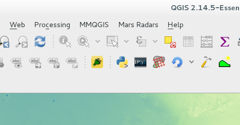

============
Installation
============

Install dependencies
====================

GNU/Linux
---------

Debian 8 (Jessie)
~~~~~~~~~~~~~~~~~

**Enable backports repository**

Enabling the official *debian backports repository* allows to install a more recent version of QGIS.
You can skip this step if you are happy with the version provided in the main repository.

Add the following line to the file */etc/apt/sources.list* (root privileges required)::

        deb http://ftp.debian.org/debian wheezy-backports main

Run repos update (as root)::

        # apt-get update

More information about *Debian backports* can be found here

http://backports.debian.org/

Official **QGIS** repositories providing newer versions of the software can be added following the instruction in 

http://qgis.org/en/site/forusers/alldownloads.html#debian-ubuntu

**Install QGIS and dependencies**

Install python and python packages::

        # apt-get install python-numpy python-qt4 python-pil

Check the available QGIS versions::

        # apt-cache showpkg qgis

The output should begin like this::

        Package: qgis
        Versions: 
        2.14.5+dfsg-1~bpo8+1 (/var/lib/apt/lists/ftp.ch.debian.org_debian_dists_jessie-...
         Description Language: 
                         File: /var/lib/apt/lists/ftp.ch.debian.org_debian_dists_jessie...
                          MD5: 49f76973cc4c2bd4a16872b7a79659ad
         Description Language: en
                         File: /var/lib/apt/lists/ftp.ch.debian.org_debian_dists_jessie...
                          MD5: 49f76973cc4c2bd4a16872b7a79659ad
        
        2.4.0-1+b1 (/var/lib/apt/lists/ftp.ch.debian.org_debian_dists_jessie_main_bina...
         Description Language: 
                         File: /var/lib/apt/lists/ftp.ch.debian.org_debian_dists_jessie...
                          MD5: 49f76973cc4c2bd4a16872b7a79659ad
         Description Language: en
                         File: /var/lib/apt/lists/ftp.ch.debian.org_debian_dists_jessie...
                          MD5: 49f76973cc4c2bd4a16872b7a79659ad

To install the most recent version::

        # apt-get install qgis=2.14.5+dfsg-1~bpo8+1

*Take care of replacing the version with the actual version available in the repository at the installation time.*

Ubuntu 16 LTS (Xenial Xerus)
~~~~~~~~~~~~~~~~~~~~~~~~~~~~

**Enable Ubuntu GIS repository**

Enabling the *Ubuntu GIS unstable repository* allows to install a more recent version of QGIS.
You can skip this step if you are happy with the version provided in the main repository.

Add the following line to the file */etc/apt/sources.list* (root privileges required)::

        deb http://ppa.launchpad.net/ubuntugis/ubuntugis-unstable/ubuntu xenial main 
        deb-src http://ppa.launchpad.net/ubuntugis/ubuntugis-unstable/ubuntu xenial main

Run repos update::

        # sudo apt-get update

More information about *Ubuntu GIS* can be found here

http://wiki.ubuntu.com/UbuntuGIS

http://trac.osgeo.org/ubuntugis/wiki/UbuntuGISRepository

Official **QGIS** repositories providing newer versions of the software can be added following the instruction in 

http://qgis.org/en/site/forusers/alldownloads.html#debian-ubuntu

**Install QGIS and dependencies**

Install python and python packages::

        # apt-get install python-numpy python-qt4 python-pil

Check the available QGIS versions::

        # apt-cache showpkg qgis

The output should begin like this::

        Package: qgis
        Versions: 
        2.14.1+dfsg-3~xenial0 (/var/lib/apt/lists/ppa.launchpad.net_ubuntugis_ubuntugis-...
         Description Language: 
                         File: /var/lib/apt/lists/ch.archive.ubuntu.com_ubuntu_dists_xen...
                          MD5: 49f76973cc4c2bd4a16872b7a79659ad
         Description Language: 
                         File: /var/lib/apt/lists/ch.archive.ubuntu.com_ubuntu_dists_xen...
                          MD5: 49f76973cc4c2bd4a16872b7a79659ad
         Description Language: en
                         File: /var/lib/apt/lists/ch.archive.ubuntu.com_ubuntu_dists_xen...
                          MD5: 49f76973cc4c2bd4a16872b7a79659ad
         Description Language: 
                         File: /var/lib/apt/lists/ppa.launchpad.net_ubuntugis_ubuntugis...
                          MD5: 49f76973cc4c2bd4a16872b7a79659ad
         Description Language: 
                         File: /var/lib/apt/lists/ppa.launchpad.net_ubuntugis_ubuntugis...
                          MD5: 49f76973cc4c2bd4a16872b7a79659ad

        2.8.6+dfsg-1build1 (/var/lib/apt/lists/ch.archive.ubuntu.com_ubuntu_dists_xenial_...
         Description Language: 
                         File: /var/lib/apt/lists/ch.archive.ubuntu.com_ubuntu_dists_xeni...
                          MD5: 49f76973cc4c2bd4a16872b7a79659ad
         Description Language: 
                         File: /var/lib/apt/lists/ch.archive.ubuntu.com_ubuntu_dists_xeni...
                          MD5: 49f76973cc4c2bd4a16872b7a79659ad
         Description Language: en
                         File: /var/lib/apt/lists/ch.archive.ubuntu.com_ubuntu_dists_xeni...
                          MD5: 49f76973cc4c2bd4a16872b7a79659ad
         Description Language: 
                         File: /var/lib/apt/lists/ppa.launchpad.net_ubuntugis_ubuntugis-u...
                          MD5: 49f76973cc4c2bd4a16872b7a79659ad
         Description Language: 
                         File: /var/lib/apt/lists/ppa.launchpad.net_ubuntugis_ubuntugis-u...
                          MD5: 49f76973cc4c2bd4a16872b7a79659ad

To install the most recent version::

        # apt-get install qgis=2.14.1+dfsg-3~xenial0

*Take care of replacing the version with the actual version available in the repository at the installation time.*

CentOS 7
~~~~~~~~

**Enable EPEL repository**

Install the proper package and update the system::

        # sudo yum install epel-release
        # sudo yum update

**Install QGIS and dependencies**

::

        # sudo yum install numpy python-pillow PyQt4 qgis

Apple OSX
---------

**Download and install QGIS**

Download and install *QGIS* from https://www.qgis.org/en/site/forusers/download.html#mac or 
directly from http://www.kyngchaos.com/software/qgis

**Download and install dependencies**

From http://www.kyngchaos.com/software/python install the following packages:

* NumPy
* PIL

Microsoft Windows
-----------------

**Download and install QGIS**

Download and install the *QGIS standalone installer* of your choice from 

http://www.qgis.org/en/site/forusers/download.html

The package contains all the required libraries .

Install MARSIS/SHARAD plug-in
=============================

Download MARSIS/SHARAD viewer
-----------------------------

You can alternatively do one of the following

* Download the latest release version (or any other version at your choice) from 

https://github.com/eSpaceEPFL/marsissharadviewer/releases

and uncompress the archive.

* Get the development version from 

https://github.com/eSpaceEPFL/marsissharadviewer

by clicking on the green button *'clone or download'*.

Uncompress the archive if you downloaded the *zip* file.

Cloning the repository requires you have `Git <http://git-scm.com/>`_ installed on your machine.

Installing the plug-in
----------------------
Copy the folder *marsissharadviewer* containing the plug-in files in the QGIS plug-ins folder.

**The folder may be named** *marsissharadviewer-<branch_name>*. **Rename it to** *marsissharadviewer*.

**Location of the QGIS plug-ins folder**

+-------------------------+--------------------------------------------------+
| Operating system        | Folder location                                  |
+=========================+==================================================+
| GNU/Linux               | /home/*{username}*/.qgis2/python/plugins         |
+-------------------------+--------------------------------------------------+
| OSX                     | /Users/*{username}*/.qgis2/python/plugins        |
+-------------------------+--------------------------------------------------+
| Windows                 | C:\\users\\{*username*}\\.qgis2\\python\\plugins |
+-------------------------+--------------------------------------------------+

|
|
|
Launch QGIS, the *'Mars Radars'* menu should appear in the menu bar as show in the figure below. 

