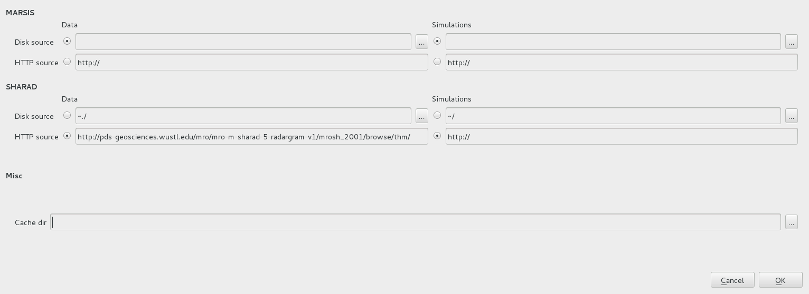
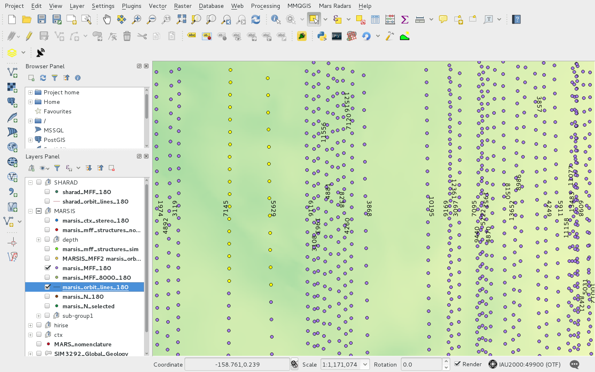
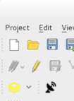
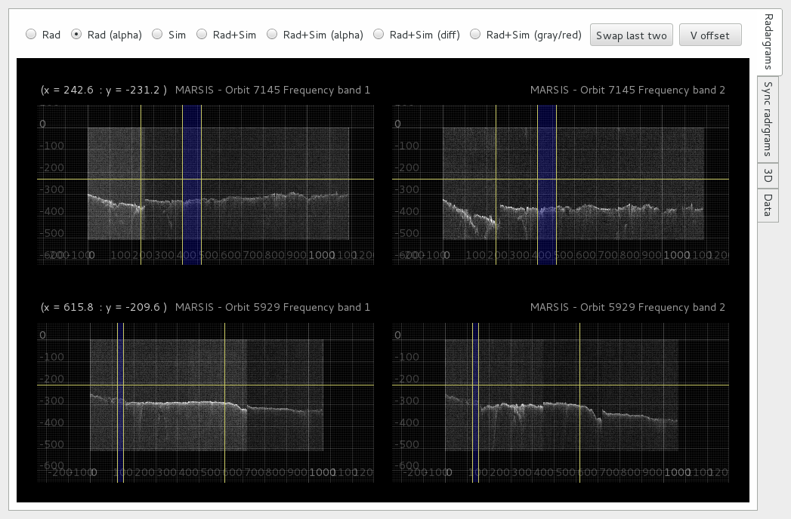
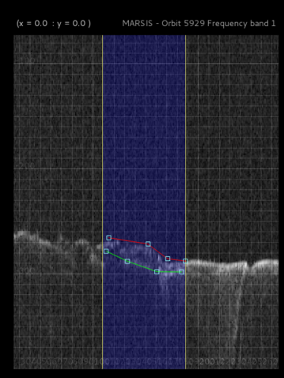
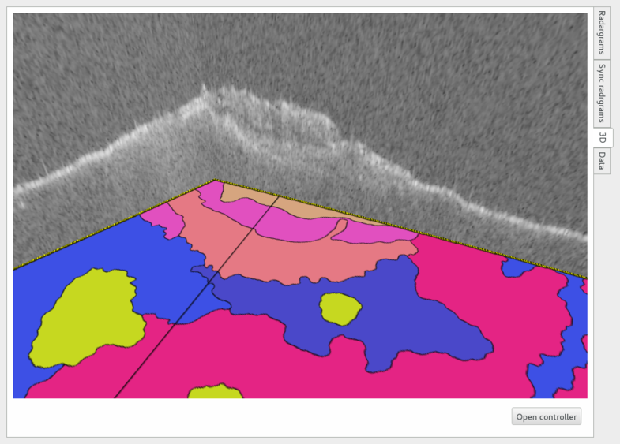

======================
Using the QGIS plug-in
======================

Set plug-in preferences
=======================

Open the *Mars radars->Settings* dialog from the meu bar.

The dialog (see figore below) allows to set the radargram source and the plug-in cache directory.

*This information must be provided before using the plug-in*

Radargrams (and possibly clutter simulations) can be fetched both from the disk and from a web server via *http* protocol.

Default server for the *SHARAD* radargrams 

(*http://pds-geosciences.wustl.edu/mro/mro-m-sharad-5-radargram-v1/mrosh_2001/browse/thm/*)

 is alredy set.

Regarding *MARSIS* data, since an official repository is not yet available, local copy of the data must be set up.

Orbits selection
================
The MARSIS/SHARAD viewer will show data on the basis of the selected features on the QGIS map.

Features can be selected with any selection tool provided by QGIS. A multiple layer selection plug-in (http://plugins.qgis.org/plugins/MultipleLayerSelection/) can be usefull.

Layers containing MARSIS and SHARAD tracks feaures must have their name starting with *marsis_* and *sharad_* respectively in order to be correctly recognised 

The image below shows a QGIS map with selected features on two MARSIS tracks.

Running the plugin
==================

Once the features of interest are selected, the plug-in can be started using either the *Mars radars->MARSIS/SHARAD Viewer* menu or by pressing the plug-in launch button (see figure below).

The viewer will open and show the radargrams belonging to the selected orbits. 

Single radargram viewer
-----------------------
The *Single radargram* is the default view provided by the plug in.

Radargrams belonging to the selected orbits will be shown, one orbit per row. For MARSIS data one radargrams per frequency band will be shown.

The section of the radargram highlighted with a blue band is the region corresponding to the selected features on the map. Plots can be zoomed and panned. For each plot, a vertical and an horizontal marker line are available.

Radio buttons at the top of the viewer allows to select among only radargrams, only clutter simulation and superposed view, using different look up table preset. The *swap last two* button toggle between the views corresponding to the last two selected radio buttons.

In case of MARSIS data, the plots of the different frequencies are synchronised.

Adjusting the selection
~~~~~~~~~~~~~~~~~~~~~~~

Moving the highlight selection will cause the features selection on the QGIS map to change accordingly. (*It is suggested to use this functionality with a small subset of orbits for a good responsiveness of the system*)

Subsurfaces depth measurement
~~~~~~~~~~~~~~~~~~~~~~~~~~~~~

The *subsurfaces depth measurement tool* allows to select subsurfaces and measure their depth with respect to the planet surface saving data on QGIS layers.

On each plot, the tool can be access by right-clicking on the mouse/touch-pad and positioning the mouse pointer on *Dpeth measurement* on the context menu. The following option are available:

* Add surface line
* Add subsurface line
* Measure...
* Load lines from selected layer

**Add surface line** add a line to be used to draw the surface. New *handles* can be added to the line clicking on it, to split the line in segments. The line and each handle can be moved to match the surface. Only one *surface line* can be added to the plot.

**Add subsurface line** add a line to be used to draw a subsurface. The *subsurface lines* act as the *surface line*. An arbitrary number of *subsurface lines* can be added to the plot.

**Measure...** compute the subsurfaces depth. Computed data (in pixels and time), together with the position of the line's handles, are stored in a new memory layer automatically added to the QGIS map. Since memory layers are not automatically saved by QGIS, a copy of the layer in *SQLite* format is saved in the *cache directory* selected in the *settings dialog*.

**Load lines from selected layer** load surface and subsurface lines from a proper selected layer. The user must select the correct layer to load data from **before** using the command.

Synchronised viewer
-------------------

The *synchronised view* acts as the default view except the radargrams belonging to different orbits are aligned by latitude and linked when zooming and panning. The aim of the view is to help to inspect structures in close, quasi-parallel radargrams.

The alignment is done on the selected area (blue highlight bands) corresponding to the features selection of the QGIS map. Outside this region, the latitude alignment is not guaranteed. 

Highlight region editing and subsurface selection are currently **not** available in this view.

3D viewer
---------

The *3D view* shows a 3D representation of the redargrams in the space, together with the map layer selected on the QGIS map. The aim of the view is to show intersecting radargrams, especially in the polar regions.

The geographic projection is the one selected on QGIS. 

Radargrams alignment
~~~~~~~~~~~~~~~~~~~~

The *Open controller* button opens a dialog to toggle the visibility and adjust the vertical alignment of each radargram as well as the map layer.

