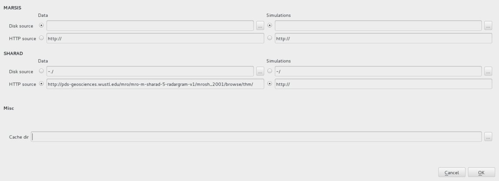
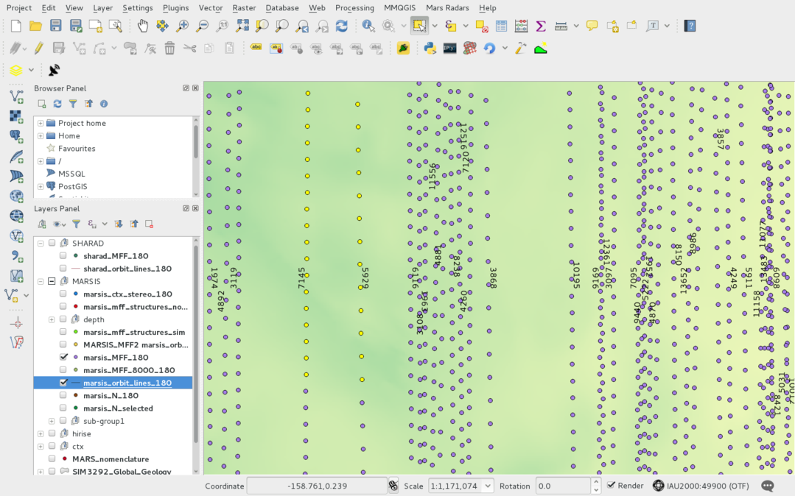
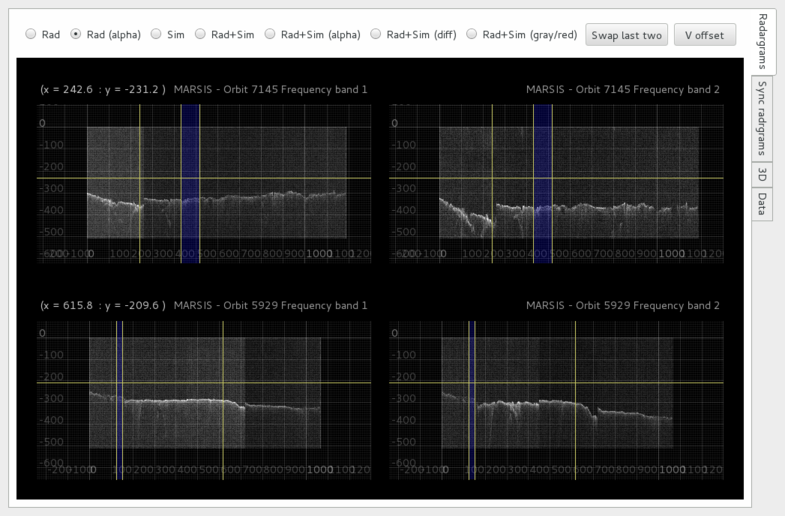

=====================
Using the QGIS plugin
=====================

Set plug-in preferencies
========================

Open the *Mars radars->Settings* dialog from the meu bar.

The dialog (see figore below) allows to set the radargram source and the plug-in cache directory.

*This information must be provided before using the plug-in*

Radargrams (and possibly clutter simulations) can be fetched both from the disk and from a web server via *http* protocol.

Default server for the *SHARAD* radargrams (*http://pds-geosciences.wustl.edu/mro/mro-m-sharad-5-radargram-v1/mrosh_2001/browse/thm/*)
 is alredy set.

Regarding *MARSIS* data, since an official repository is not yet available, local copy of the data must be set up.

Orbits selection
================
The MARSIS/SHARAD viewer will show data on the basis of the selected features on the QGIS map.

Features can be selected with any selection tool provided by QGIS. A multiple layer selection plug-in (http://plugins.qgis.org/plugins/MultipleLayerSelection/) can be usefull.

Layers containing MARSIS and SHARAD tracks feaures must have their name starting with *marsis_* and *sharad_* respectively in order to be correctly recognised 

The image below shows a QGIS map with selected features on two MARSIS tracks.

Running the plugin
==================

Once the features of interest are selected, the plug-in can be started using either the *Mars radars->MARSIS/SHARAD Viewer* menu or by pressing the plug-in launch button (see figure below).

The viewer will open and show the radargrams belonging to the selected orbits. 

Single radargram viewer
-----------------------
The *Single radargram* is the default view provided by the plug in.

Radargrams belonging to the selected orbits will be shown, one orbit per row. For MARSIS data one radargrams per frequency band will be shown.

The section of the radargram highlighted with a blue band is the region corresponding to the selected features on the map. Plots can be zoomed and panned. For each plot, a vertical and an horizontal marker line are available.

Moving the highlight selection will cause the features selection on the QGIS map to change accordingly. (*It is suggested to use this functionality with a small subset of orbits for a good responsivness of the system*)

Radio buttons at the top of the viewer allows to select among only radargrams, only clutter simulation and superposed view, using different look up table preset.

In case of MARSIS data, the plots of the different frequencies are syncronized.

Adjusting the selection
~~~~~~~~~~~~~~~~~~~~~~~

Subsurfaces depth measurement
~~~~~~~~~~~~~~~~~~~~~~~~~~~~~

Synchronised viewer
-------------------

3D viewer
---------

